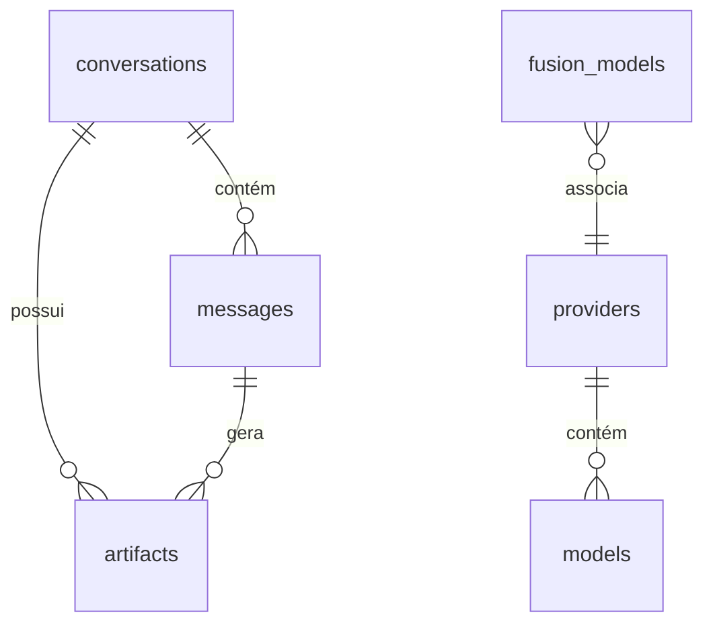

# ⬡ NexusLocal — Documentação do Sistema

Este documento fornece uma visão técnica e funcional abrangente do **NexusLocal**, detalhando sua arquitetura, esquema de banco de dados e o funcionamento de seus três módulos avançados: **Prompt Enhancer**, **Modo Fusion** e **Sistema de Artifacts**.

---

## 1. Visão Geral do Projeto

O **NexusLocal** é uma interface de chat local projetada para integrar e orquestrar múltiplos modelos de linguagem (LLMs) usando chaves de API de provedores com tiers gratuitos (como Groq, Gemini, OpenRouter, Cerebras, NVIDIA NIM, SambaNova, SiliconFlow, FreeTheAI, LLM7.io e LongCat).

### Stack Tecnológica
*   **Backend**: Python 3 + FastAPI + WebSockets (para streaming em tempo real) + `aiosqlite` (driver SQLite assíncrono).
*   **Frontend**: React 18 + TypeScript + Vite + Zustand (gerenciamento de estado leve).
*   **Banco de Dados**: SQLite local (salva conversas, configurações de chaves, cache de respostas e artefatos).

---

## 2. Arquitetura e Estrutura de Pastas

O projeto está dividido em duas partes principais:

```
nexuslocal/
├── backend/
│   ├── main.py              ← Inicialização da API FastAPI e rotas
│   ├── database.py          ← Gerenciador de conexão SQLite, esquemas e inicialização de tabelas
│   ├── models.py            ← Modelos de dados Pydantic para validação de requests/responses
│   ├── providers/
│   │   ├── base.py          ← Adaptador universal compatível com o padrão OpenAI
│   │   └── registry.py      ← Mapeador e gerenciador de provedores ativos
│   ├── fusion/
│   │   ├── __init__.py
│   │   └── orchestrator.py  ← Lógica de chamadas concorrentes do Modo Fusion
│   └── routers/
│       ├── chat.py          ← Canal WebSocket principal de chat
│       ├── conversations.py ← Operações de histórico (CRUD)
│       ├── admin.py         ← Configurações de chaves e provedores
│       ├── enhancer.py      ← Endpoints do otimizador de prompt (Magic Wand)
│       ├── fusion.py        ← Endpoints do preset de fusão
│       └── artifacts.py     ← Endpoints do painel de artefatos
└── frontend/
    └── src/
        ├── components/      ← Painéis de controle, Sidebar, Chat, Configurações
        ├── hooks/           ← useChat (gerenciamento de conexão WebSocket)
        ├── store/           ← Zustand store centralizado (estado do app)
        ├── api/             ← Cliente HTTP para comunicação com o backend
        ├── types.ts         ← Tipagens TypeScript globais (incluindo pacotes WebSocket)
        └── index.css        ← Design system, variáveis de cor, animações e layouts
```

---

## 3. Esquema do Banco de Dados (SQLite)

O banco de dados SQLite (`nexuslocal.db`) centraliza a persistência local do aplicativo. Abaixo está a definição das tabelas relacionadas aos recursos principais e avançados:



### Tabelas Principais do Chat
*   **`providers`**: Registra os provedores de IA cadastrados, URLs base, chaves de API e status.
*   **`models`**: Lista os modelos suportados por cada provedor, comprimento do contexto e status de habilitação.
*   **`conversations`**: Registra as sessões de chat criadas pelo usuário.
*   **`messages`**: Armazena o histórico de mensagens de cada chat com a função do autor (`user`, `assistant`, `system`).
*   **`cache_exact` / `cache_semantic`**: Armazenamento para caches de respostas exatas e semânticas.

### Tabelas de Funcionalidades Avançadas
*   **`enhancer_config`**: Armazena as preferências do Melhorador de Prompt (Provedor, Modelo, Prompt do Sistema e se está ativo).
*   **`fusion_config`**: Registra as preferências do Modelo Juiz do modo Fusion.
*   **`fusion_models`**: Lista os modelos adicionados para rodarem em paralelo no modo Fusion. Garante unicidade por provedor (`UNIQUE(provider_id)`).
*   **`artifacts`**: Registra os documentos interativos gerados (HTML, MD, SVG, Código) vinculados a uma mensagem e conversa. Possui versionamento e agrupamento lógico.

---

## 4. Funcionalidades Avançadas

### 4.1 Prompt Enhancer (Varinha Mágica ✦)

O **Prompt Enhancer** adiciona um botão de varinha mágica dentro da área de texto do chat. Ao ser clicado, ele envia o rascunho do prompt a um modelo de linguagem otimizado para reescrevê-lo, aplicando técnicas de engenharia de prompt.

```
[ Usuário digita prompt simples ]
           │
           ▼
 [ Clica no botão Sparkles (✦) ]
           │
           ▼
[ API POST /api/enhancer/process ] ──> [ Consulta enhancer_config ]
                                                  │
                                                  ▼
                                       [ Envia chamada a LLM ]
                                                  │
                                                  ▼
[ Retorna prompt otimizado ] <────────────────────┘
           │
           ▼
[ Substitui texto no input e foca para revisão ]
```

#### Detalhes Técnicos:
*   **Prompt de Sistema (Fallback)**:
    > "Você é um engenheiro de prompt especialista. Seu objetivo é pegar o prompt simples enviado pelo usuário e expandi-lo, adicionando clareza, contexto implícito, estrutura lógica e removendo ambiguidades. Retorne APENAS o prompt aprimorado final, sem introduções, explicações ou aspas."
*   **Endpoints**:
    *   `GET  /api/enhancer/config`: Retorna a configuração do modelo otimizador.
    *   `POST /api/enhancer/config`: Atualiza a configuração.
    *   `POST /api/enhancer/process`: Recebe o prompt original e retorna a versão otimizada de forma síncrona (não-streaming).
*   **Interface (UX)**:
    *   O botão exibe um spinner enquanto processa e a área de texto fica em modo somente leitura.
    *   Retorna toasts claros em caso de falha (ex: chave de API não configurada).

---

### 4.2 Modo Fusion (🧬 Fusão de Respostas)

O **Modo Fusion** dispara a mesma pergunta em paralelo para múltiplos modelos de diferentes provedores. Quando todas as respostas chegam, um **Modelo Juiz** as analisa e consolida em uma única resposta final rica e sem alucinações, que é enviada via streaming para o usuário.

```
                           ┌──> [ Groq / Llama 3.3 ] ────┐
                           │                             │
[ Usuário envia pergunta ] ├──> [ Gemini 2.0 Flash ] ────┼─> [ Modelo Juiz ] ──> [ Streaming Final ]
                           │                             │
                           └──> [ Cerebras / Llama 3 ] ──┘
```

#### Regra de Ouro (RPM Safety)
Os provedores de IA gratuitos impõem limites severos de requisições por minuto (RPM). Para evitar erros `429 (Too Many Requests)`, o NexusLocal obriga a regra de **um modelo por provedor**. A interface de configuração bloqueia visualmente e o banco restringe (`UNIQUE(provider_id)`) a adição de modelos repetidos no mesmo grupo paralelo.

#### Orquestração de Backend (`backend/fusion/orchestrator.py`)
Utiliza `asyncio.gather` para disparar as tarefas concorrentes. A mensagem WebSocket é estendida com eventos específicos para notificar o frontend em tempo real sobre o status de cada modelo.

#### UX e Status Card (`FusionStatusCard`)
Enquanto os modelos rodam em paralelo, a tela do chat exibe um painel com o progresso de cada um:
1.  **Status Ocioso/Aguardando** (esperando início).
2.  **Status Executando** (texto pulsante e spinner).
3.  **Status Concluído (✅)** ou **Erro (❌)**.
4.  Após a conclusão dos modelos paralelos, a linha do **Juiz** acende e inicia o streaming. O card colapsa suavemente em uma barra tipo *accordion* acima da resposta final, permitindo expansão se o usuário quiser ler as respostas individuais originais.

---

### 4.3 Sistema de Artifacts (Painel Split-Screen)

Inspirado nos artefatos do Claude, o **Sistema de Artifacts** renderiza documentos complexos (HTML, SVG, Markdown longos e blocos de código extensos) em um painel interativo à direita da tela, deixando a conversa limpa.

```
┌───────────────────────────────────────┬────────────────────────────────────────┐
│         ChatWindow (Esquerda)         │         ArtifactPanel (Direita)        │
│                                       │                                        │
│ Usuário: Crie um gráfico SVG...       │ Toolbar: [HTML] v2   [Copiar] [Abrir]  │
│                                       │ ────────────────────────────────────── │
│ Assistente: Aqui está o SVG...        │                                        │
│ ┌───────────────────────────────────┐ │                <svg>                   │
│ │ 📄 SVG Image (v2)                 │ │         (Renderização Visual)          │
│ │ [Clique para abrir no painel]     │ │                                        │
│ └───────────────────────────────────┘ │                                        │
└───────────────────────────────────────┴────────────────────────────────────────┘
```

#### Heurística de Detecção
Ao fim de um fluxo de mensagem, o backend avalia a presença de conteúdo estruturado:
*   **`html`**: Blocos delimitados por ` ```html ` ou tags `<html>`.
*   **`svg`**: Blocos delimitados por ` ```svg `.
*   **`code`**: Qualquer bloco de código contendo 15 ou mais linhas de extensão.
*   **`markdown`**: Documentos estruturados longos (mínimo de 20 linhas e pelo menos dois cabeçalhos `#`).

#### Limitação do Modo Fusion
Em diálogos que utilizam o Modo Fusion, apenas a **resposta final compilada pelo Juiz** pode acionar a criação de artefatos. As respostas intermediárias geradas pelos modelos em paralelo nunca poluem o banco de dados de artefatos.

#### Fases do Desenvolvimento
*   **Fase 1 (MVP)**: Detecção via Regex, salvamento estruturado no banco, rota básica CRUD e painel lateral com renderizador dinâmico.
*   **Fase 2 (UX & Polimento)**:
    *   Botões de ação rápida na Toolbar (Copiar para área de transferência, fazer Download local e Abrir em tela cheia).
    *   Histórico de versões: múltiplos artefatos criados sob a mesma chave lógica (`artifact_group_id`) geram versões sucessivas (v1, v2, v3...), com navegação por abas ou dropdown.
    *   Responsividade móvel e transições suaves de abertura.
*   **Fase 3 (Avançado — Em Progresso/Futuro)**:
    *   *Edição Inline*: Área de texto sob o artefato permitindo enviar correções diretas a ele (o modelo gera uma nova versão apenas do documento).
    *   *Transpilação JSX/React*: Execução de componentes React completos no cliente via Babel Standalone.
    *   *Sandbox Avançado e Execução*: Permitir execução de código (HTML/JS) com isolamento rigoroso de iframe (`sandbox` configurado estritamente sem permissões cruzadas que possam vazar segredos locais ou cookies).

#### Diretrizes de Segurança de Sandbox
Ao renderizar HTML de terceiros gerado por LLMs:
*   Utilizar `<iframe sandbox="allow-scripts">` (nunca combinando `allow-scripts` com `allow-same-origin` de forma que permita ao iframe acessar o localStorage do NexusLocal e roubar chaves de API locais).
*   Garantir sanitização básica para títulos e campos injetados diretamente na árvore do DOM.
