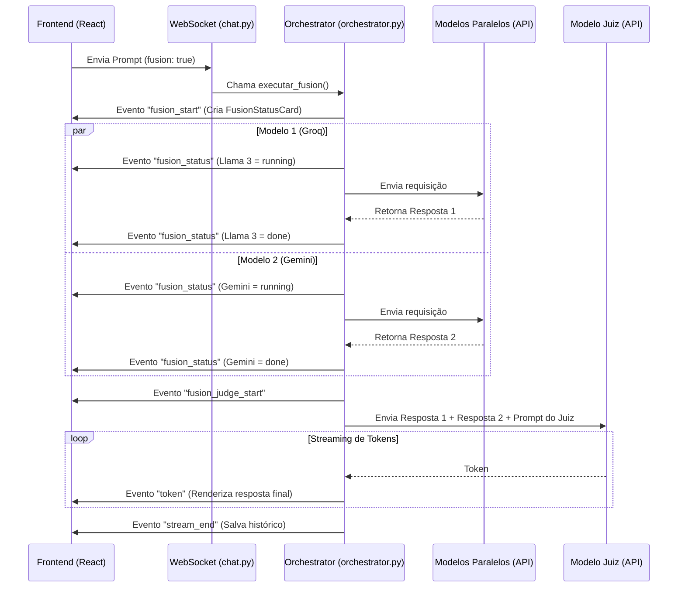

# Componente Fusion: Explicação e Propostas de Melhoria

O **Modo Fusion** é uma funcionalidade avançada do NexusLocal que implementa um padrão de consenso multi-LLM. Em vez de enviar uma pergunta para um único modelo, o sistema a dispara concorrentemente para vários modelos e usa um **Modelo Juiz** (Judge) para consolidar e refinar as respostas em um veredito unificado e otimizado.

---

## 1. Tecnologias Utilizadas

### Backend (Python/FastAPI)
*   **FastAPI & WebSockets**: Para comunicação assíncrona bidirecional em tempo real (streaming de status e tokens).
*   **`asyncio` (`asyncio.gather`)**: Permite disparar as requisições das LLMs paralelas de forma totalmente concorrente sem bloquear a execução principal.
*   **SQLite / `aiosqlite`**: Banco de dados relacional local onde são armazenadas as configurações de models e judge, além do histórico de mensagens e artifacts.
*   **Pydantic**: Para validação e parsing dos dados de configuração que chegam aos endpoints REST.

### Frontend (React/TypeScript)
*   **Zustand**: Biblioteca de gerenciamento de estado global. Gerencia estados e ações de progresso do Fusion durante a transmissão.
*   **React Markdown & Remark GFM**: Para renderizar com formatação rica as respostas individuais de cada modelo dentro do card expansível.
*   **Lucide React**: Biblioteca de ícones (representados pelo DNA 🧬 para o Fusion e cérebro 🧠 para o Juiz).

---

## 2. Arquivos Envolvidos e Responsabilidades

### Backend (Orquestração e API)

1.  **[database.py](file:///j:/Arquivos%20Osmar/Multi+/backend/database.py)**
    *   **Função**: Define o esquema das tabelas `fusion_config` (configuração do modelo Juiz e status global) e `fusion_models` (tabela de modelos paralelos).
    *   **Ponto Chave**: A tabela `fusion_models` possui uma restrição `UNIQUE(provider_id)` para impedir o uso de múltiplos modelos do mesmo provedor, uma medida de segurança para evitar erros de limite de requisições (*Rate Limits - RPM*).

2.  **[orchestrator.py](file:///j:/Arquivos%20Osmar/Multi+/backend/fusion/orchestrator.py)**
    *   **Função**: O núcleo da execução do Fusion. Executa a função `executar_fusion`.
    *   **Fluxo**:
        1. Carrega as definições de modelos paralelos e do Juiz do banco de dados.
        2. Dispara o evento de WebSocket `fusion_start` informando quais modelos serão executados.
        3. Invoca concorrentemente a função `chamar_modelo` para cada modelo paralelo via `asyncio.gather`.
        4. Transmite o status individual (`running`, `done` com resposta, `error`) de cada modelo via eventos `fusion_status`.
        5. Formata os outputs das respostas válidas dos modelos paralelos em um bloco estruturado.
        6. Envia o evento `fusion_judge_start` e dispara o modelo Juiz, transmitindo via streaming os tokens do veredito consolidado (`token`).
        7. Salva a resposta do Juiz na tabela de mensagens, detecta e persiste artifacts e finaliza com `stream_end`.

3.  **[fusion.py (Router)](file:///j:/Arquivos%20Osmar/Multi+/backend/routers/fusion.py)**
    *   **Função**: Expõe os endpoints REST (`/api/fusion/...`) para buscar e atualizar as configurações do modo Fusion, adicionar novos modelos paralelos e remover modelos do grupo.

4.  **[chat.py (Router)](file:///j:/Arquivos%20Osmar/Multi+/backend/routers/chat.py)**
    *   **Função**: Gerencia a conexão WebSocket do chat. Se a mensagem do cliente contiver a flag `fusion: true`, o roteador desvia o fluxo tradicional e chama o `executar_fusion` localizado no orchestrator.

---

### Frontend (Interface e Estado)

1.  **[types.ts](file:///j:/Arquivos%20Osmar/Multi+/frontend/src/types.ts)**
    *   **Função**: Define interfaces TypeScript do componente, incluindo `FusionConfig`, `FusionModelStatus`, `FusionStatusEntry`, e as estruturas de mensagens do WebSocket (`WSMessage`).

2.  **[useStore.ts (Zustand)](file:///j:/Arquivos%20Osmar/Multi+/frontend/src/store/useStore.ts)**
    *   **Função**: Mantém o estado global do Fusion (`fusionMode`, `fusionActive`, etc.) e as ações `setFusionStatuses`, `updateFusionStatus` e `setFusionJudgeModelId`.
    *   **Ponto Chave**: `setFusionStatuses` injeta dinamicamente uma mensagem virtual de tipo `fusion_status` no histórico do chat para renderizar o painel de carregamento.

3.  **[useChat.ts (Hook)](file:///j:/Arquivos%20Osmar/Multi+/frontend/src/hooks/useChat.ts)**
    *   **Função**: Ouve as mensagens do WebSocket. Quando recebe os eventos `fusion_start`, `fusion_status` e `fusion_judge_start`, chama as respectivas ações do Zustand store para atualizar a interface do usuário em tempo real.

4.  **[FusionSettings.tsx](file:///j:/Arquivos%20Osmar/Multi+/frontend/src/components/FusionSettings.tsx)**
    *   **Função**: Painel de configurações no painel administrativo onde o usuário seleciona quais modelos rodam em paralelo, define qual provedor/modelo atuará como Juiz, ajusta o System Prompt de consolidação e ativa/desativa globalmente a funcionalidade.
    *   **Ponto Chave**: Bloqueia visualmente a seleção de provedores já escolhidos em outras linhas paralelas para respeitar a restrição de segurança contra rate limits.

5.  **[FusionStatusCard.tsx](file:///j:/Arquivos%20Osmar/Multi+/frontend/src/components/FusionStatusCard.tsx)**
    *   **Função**: Card interativo exibido no fluxo da conversa. Mostra animações de progresso ("carregando") para os modelos paralelos, indica erros se houverem e, uma vez concluído, permite que o usuário expanda o card para ler as respostas originais de cada modelo participante.

6.  **[ChatWindow.tsx](file:///j:/Arquivos%20Osmar/Multi+/frontend/src/components/ChatWindow.tsx)**
    *   **Função**: Identifica mensagens com a role `fusion_status` na lista de mensagens e delega a renderização para a `FusionStatusCard`.

---

## 3. Fluxo de Execução Simplificado

---

## 4. Sugestões de Melhorias para Avaliação

### 💡 Melhoria A: Permitir Múltiplos Modelos por Provedor (Opcional)
*   **Problema Atual**: O bloqueio `UNIQUE(provider_id)` na tabela `fusion_models` e a restrição visual na tela de configurações (`FusionSettings.tsx`) limitam o uso de múltiplos modelos de um único provedor (ex: usar simultaneamente o *GPT-4o* e o *GPT-4o-mini*).
*   **Solução Proposta**:
    1. Alterar a constraint única do banco no `database.py` para `UNIQUE(provider_id, model_id)`.
    2. Remover a limitação de seleção no frontend.
    3. Adicionar um indicador/alerta de segurança (ex: *"Aviso: Usar múltiplos modelos do mesmo provedor pode exceder limites de taxa (Rate Limits) em chaves gratuitas"*).
*   **Complexidade**: Baixa.

### 💡 Melhoria B: Resiliência contra Falha do Modelo Juiz (Fallback Judge)
*   **Problema Atual**: Se o Modelo Juiz apresentar falha (erro de API ou esgotamento de cota), a execução falha completamente e o progresso das respostas paralelas é descartado, resultando em uma mensagem de erro para o usuário.
*   **Solução Proposta**:
    *   No arquivo `orchestrator.py`, implementar um bloco `try/except` na chamada do Juiz. Se o Juiz principal falhar, o orchestrator tenta automaticamente uma chamada a um modelo de backup (por exemplo, um modelo gratuito de failover do Groq ou Gemini).
*   **Complexidade**: Baixa-Média.

### 💡 Melhoria C: Persistência das Respostas Paralelas no Histórico
*   **Problema Atual**: O card `FusionStatusCard` exibe as respostas dos modelos individuais de maneira interativa durante a sessão. Porém, essas respostas não são persistidas no banco de dados. Ao atualizar a página ou recarregar a conversa, o card reaparece vazio ou as respostas individuais são perdidas.
*   **Solução Proposta**:
    1. Criar uma tabela `fusion_message_details` contendo as colunas: `message_id`, `model_id`, `provider_id`, `response` e `status`.
    2. Após receber o retorno dos modelos paralelos em `orchestrator.py`, gravar essas respostas vinculadas ao `assistant_msg_id` (ou no `conversation_id`).
    3. Adaptar a consulta de carregamento da conversa para trazer esses dados e exibi-los no frontend mesmo ao recarregar a página.
*   **Complexidade**: Média.

### 💡 Melhoria D: Personas e Prompts Customizados para Modelos Paralelos
*   **Problema Atual**: Todos os modelos recebem exatamente o mesmo histórico e prompt original do usuário.
*   **Solução Proposta**:
    *   Permitir que na tela de configurações o usuário defina pequenas instruções ou personas para cada modelo paralelo (ex: *"Modelo 1: Foque em segurança de código"*, *"Modelo 2: Foque em performance e otimização"*). O Juiz então recebe pontos de vista especializados, gerando uma consolidação rica e multidimensional.
*   **Complexidade**: Média-Alta.

### 💡 Melhoria E: Modo de Comparação Lado a Lado (Arena Mode)
*   **Problema Atual**: O usuário é obrigado a ver apenas a resposta consolidada do Juiz.
*   **Solução Proposta**:
    *   Criar um alternador visual no frontend que permita ver a resposta unificada ou abrir uma visualização em colunas paralelas ("Arena") para comparar visualmente e na íntegra a resposta bruta de cada modelo de forma lado-a-lado.
*   **Complexidade**: Média.
