# Análise de Gaps — NexusLocal vs. Produtos Profissionais

> Avaliação completa do projeto atual contra funcionalidades oferecidas por ChatGPT, Claude, Grok e Gemini nos seus planos pagos, filtrada pela proposta do NexusLocal como **integrador de modelos gratuitos**.

---

## O que o NexusLocal já tem (e está sólido)

| Feature | Status | Observação |
|---|---|---|
| Chat com streaming via WebSocket | ✅ | Funcional e responsivo |
| Multi-provider (10 providers, 40+ modelos) | ✅ | Groq, OpenRouter, Gemini, Cerebras, SambaNova, Cloudflare, HuggingFace, z.ai, Ollama, NVIDIA |
| Histórico de conversas (CRUD + agrupamento) | ✅ | Renomear, deletar, agrupamento temporal |
| Modo Fusion (fan-out + juiz consolidador) | ✅ | Diferencial único, com accordion de respostas individuais |
| Cache inteligente (exato + semântico) | ✅ | Economia de tokens, embeddings locais |
| Melhorador de Prompt (Enhancer) | ✅ | Reescrita automática antes do envio |
| Admin Panel (chaves, modelos, sync) | ✅ | Completo com toggle de modelos e auto-sync |
| Design system dark premium | ✅ | Estilo editorial inspirado no Claude.ai |
| Markdown rendering nas respostas | ✅ | Com blocos de código, GFM tables, etc. |
| Seletor de provider + modelo (dois níveis) | ✅ | UX profissional |

---

## 🔴 Tier 1 — Críticos para lançamento (o usuário espera e nota a ausência)

### 1. System Prompts / Personas por Conversa
**O que é:** Permitir definir um system prompt customizado por conversa (ou globalmente). ChatGPT chama de "Custom Instructions", Claude de "System Prompt".
**Por que falta:** Hoje o NexusLocal não envia nenhum system prompt — todas as conversas são `messages: [{role: "user", ...}]` sem contexto de persona.
**Impacto:** Alto. Sem isso, o produto é um "tubo" para o modelo — o usuário perde controle sobre tom, formato e comportamento.
**Esforço:** Baixo (~2-3h)

---

### 2. Exportação de Conversas
**O que é:** Exportar conversa como Markdown, JSON ou PDF. Todos os concorrentes oferecem (Claude: copy all, ChatGPT: share/export, Gemini: export).
**Por que falta:** Listado no README como planejado, mas não implementado.
**Impacto:** Médio-Alto. Usuário não consegue salvar ou compartilhar insights valiosos gerados pelas conversas.
**Esforço:** Baixo (~1-2h)

---

### 3. Stop Generation (Parar Geração)
**O que é:** Botão funcional para interromper o streaming do modelo no meio da resposta.
**Por que falta:** O botão "Stop" já existe visualmente no UI (`send-btn.stop`) mas **não envia um sinal de cancelamento** ao backend — o WebSocket continua recebendo tokens.
**Impacto:** Alto. É frustrante não poder parar uma resposta longa/irrelevante. Todo concorrente tem isso.
**Esforço:** Baixo (~1-2h)

---

### 4. Busca no Histórico de Conversas
**O que é:** Barra de busca na sidebar para filtrar conversas por título ou conteúdo.
**Por que falta:** Não implementado. A sidebar só mostra a lista cronológica.
**Impacto:** Médio-Alto. Com o uso diário, o histórico cresce rapidamente e fica impossível encontrar conversas passadas.
**Esforço:** Baixo (~2h)

---

### 5. Error Handling e Retry Robusto
**O que é:** Tratamento visual de erros (modelo offline, rate limit 429, timeout) com botão de "Tentar novamente" e fallback automático.
**Por que falta:** Erros são logados no console mas o UX não trata de forma amigável. Se um provider cai, o usuário vê apenas um erro genérico.
**Impacto:** Alto para percepção de profissionalismo. Produto free depende de APIs instáveis.
**Esforço:** Médio (~3-4h)

---

### 6. Responsividade Mobile
**O que é:** Layout funcional em telas pequenas (celular/tablet). A sidebar deve colapsar, o input deve ser acessível.
**Por que falta:** O CSS atual usa larguras fixas e não tem media queries. A sidebar não se adapta.
**Impacto:** Alto. Muitos usuários acessam via celular. Sem isso, perde-se 40-60% do público potencial.
**Esforço:** Médio (~4-6h)

---

## 🟡 Tier 2 — Importantes para competir (diferenciam de um MVP)

### 7. Regenerar Resposta
**O que é:** Botão "Regenerar" na mensagem do assistente para obter uma nova resposta sem redigitar o prompt.
**Por que falta:** Não implementado. O usuário precisa copiar e colar o prompt anterior.
**Impacto:** Médio. Feature de conveniência que todos os concorrentes têm.
**Esforço:** Baixo (~2h)

---

### 8. Editar Mensagem do Usuário
**O que é:** Clicar em uma mensagem enviada e editá-la, gerando uma nova resposta a partir da versão editada.
**Por que falta:** Não implementado.
**Impacto:** Médio. ChatGPT e Claude oferecem. Evita retrabalho.
**Esforço:** Médio (~3h)

---

### 9. Copiar Blocos de Código Individuais
**O que é:** Botão "Copy" em cada bloco de código na resposta. Hoje só existe o botão de copiar a mensagem inteira.
**Por que falta:** O componente `code-block` não tem botão de cópia.
**Impacto:** Médio. Essencial para desenvolvedores, que são o público-alvo natural.
**Esforço:** Baixo (~1h)

---

### 10. Indicador de Modelo na Mensagem
**O que é:** Exibir qual modelo/provider gerou cada resposta (badge discreto na mensagem do assistente).
**Por que falta:** O `model_id` já é salvo no banco, mas não é exibido na UI.
**Impacto:** Médio. Em um integrador multi-modelo, saber qual modelo respondeu é informação essencial para o usuário aprender qual é melhor para cada tarefa.
**Esforço:** Baixo (~1h)

---

### 11. Temas / Aparência (Dark/Light Toggle)
**O que é:** Permitir alternar entre tema dark e light (ou automático baseado no OS).
**Por que falta:** Só existe dark mode hardcoded.
**Impacto:** Médio. Muitos usuários preferem light mode durante o dia.
**Esforço:** Médio (~4h, precisa duplicar variáveis CSS)

---

### 12. Atalhos de Teclado (Keyboard Shortcuts)
**O que é:** `Ctrl+N` nova conversa, `Ctrl+Shift+S` toggle sidebar, `Ctrl+/` foco no input, etc.
**Por que falta:** Não implementado. Hoje só `Enter` para enviar e `Shift+Enter` para nova linha.
**Impacto:** Médio. Power users esperam atalhos.
**Esforço:** Baixo (~2h)

---

## 🟢 Tier 3 — Diferenciais premium (elevam acima dos concorrentes)

### 13. Comparação A/B de Modelos (Side-by-Side)
**O que é:** Enviar o mesmo prompt para 2 modelos e ver as respostas lado a lado para comparar qualidade, velocidade e estilo. Diferente do Fusion (que consolida), o A/B é para **avaliação visual**.
**Por que falta:** Não existe. O Fusion consolida mas não permite comparar visualmente.
**Impacto:** Alto como diferencial. Nenhum concorrente free oferece isso de forma nativa.
**Esforço:** Médio-Alto (~6-8h)

---

### 14. Métricas de Performance por Modelo
**O que é:** Rastrear tokens/s, latência de first-token, taxa de erro por modelo/provider. Exibir num dashboard ou badge.
**Por que falta:** Nenhuma métrica de performance é coletada.
**Impacto:** Alto como diferencial. Ajuda o usuário a escolher o melhor modelo para cada tarefa. Nenhum concorrente mostra isso.
**Esforço:** Médio (~4-5h)

---

### 15. Pastas/Tags para Organizar Conversas
**O que é:** Agrupar conversas em pastas (Trabalho, Pessoal, Código, etc.) ou aplicar tags. ChatGPT tem projetos, Claude tem projetos.
**Por que falta:** Organização é apenas cronológica (Hoje/Ontem/7 dias).
**Impacto:** Médio. Importante para uso profissional contínuo.
**Esforço:** Médio (~4-5h, schema + UI)

---

### 16. Modo Offline com Ollama
**O que é:** Integração first-class com Ollama para rodar modelos 100% locais, sem internet.
**Por que falta:** Ollama está listado como provider mas com URL placeholder (`api.z.ai` em vez de `localhost:11434`). Não funciona.
**Impacto:** Alto como diferencial. Privacidade total + independência de APIs externas.
**Esforço:** Baixo (~1-2h, corrigir URL + auto-detect)

---

### 17. Upload de Arquivos / Contexto
**O que é:** Anexar arquivos (txt, PDF, código) ao chat para o modelo analisar.
**Por que falta:** Não implementado. Sem botão de upload.
**Impacto:** Alto. ChatGPT, Claude e Gemini oferecem. Mas depende de os modelos free suportarem contextos longos (Gemini suporta até 1M tokens, viável).
**Esforço:** Alto (~8-12h, parsing de arquivos + UI)

---

## 🐛 Bugs e Dívidas Técnicas Encontrados

| Item | Arquivo | Severidade |
|---|---|---|
| Ollama `base_url` aponta para `api.z.ai` em vez de `localhost:11434` | [database.py](file:///j:/Arquivos%20Osmar/Multi+/backend/database.py#L183-L191) | 🔴 Crítico |
| Nome do usuário hardcoded como "Osmar" em dois arquivos | [Sidebar.tsx](file:///j:/Arquivos%20Osmar/Multi+/frontend/src/components/Sidebar.tsx#L5), [ChatWindow.tsx](file:///j:/Arquivos%20Osmar/Multi+/frontend/src/components/ChatWindow.tsx#L10) | 🟡 Médio |
| Botão Stop não cancela a geração de fato | [MessageInput.tsx](file:///j:/Arquivos%20Osmar/Multi+/frontend/src/components/MessageInput.tsx#L117-L123) | 🔴 Crítico |
| README desatualizado (não menciona Cache, Enhancer, Fusion implementados) | [README.md](file:///j:/Arquivos%20Osmar/Multi+/README.md#L59-L64) | 🟡 Médio |
| CORS restrito a `localhost:5173` — não funciona se hospedar na rede local | [main.py](file:///j:/Arquivos%20Osmar/Multi+/backend/main.py#L18-L24) | 🟡 Médio |

---

## Roadmap Sugerido para Lançamento

```mermaid
gantt
    title Roadmap NexusLocal → v1.0 (Release)
    dateFormat  X
    axisFormat %s

    section Tier 1 - Críticos
    System Prompts           :a1, 0, 3
    Stop Generation          :a2, 0, 2
    Error Handling + Retry   :a3, 2, 4
    Busca no Histórico       :a4, 2, 2
    Export Conversas         :a5, 4, 2
    Responsividade Mobile    :a6, 4, 6

    section Tier 2 - Importantes
    Regenerar Resposta       :b1, 6, 2
    Copiar Blocos de Código  :b2, 6, 1
    Badge do Modelo          :b3, 6, 1
    Editar Mensagem          :b4, 8, 3
    Atalhos de Teclado       :b5, 8, 2

    section Tier 3 - Diferenciais
    Comparação A/B           :c1, 10, 8
    Métricas de Performance  :c2, 10, 5
    Ollama fix + auto-detect :c3, 10, 2
    Pastas/Tags              :c4, 15, 5

    section Bugs
    Fix Ollama URL           :d1, 0, 1
    Fix Stop button          :d2, 0, 2
    Fix hardcoded username   :d3, 0, 1
    Atualizar README         :d4, 18, 2
```

---

## Resumo Executivo

| Categoria | Itens | Esforço Total Estimado |
|---|---|---|
| 🔴 Críticos para lançamento | 6 | ~15h |
| 🟡 Importantes para competir | 6 | ~13h |
| 🟢 Diferenciais premium | 5 | ~25h |
| 🐛 Bugs/Dívida técnica | 5 | ~4h |
| **Total** | **22 itens** | **~57h** |

---
**Nota:** Este documento foi gerado automaticamente para guiar as próximas fases de desenvolvimento do NexusLocal.
